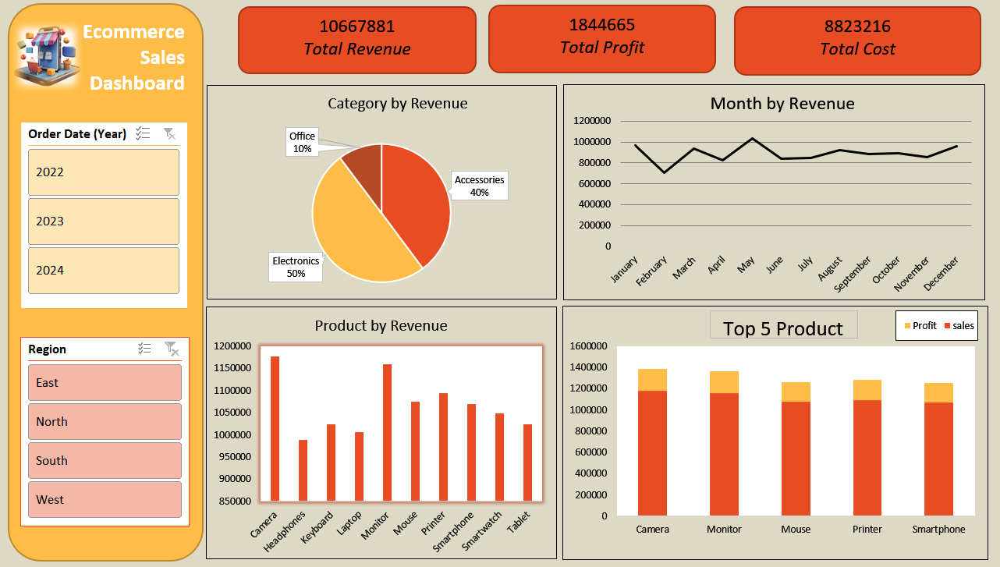

# Ecommerce Sales Dashboard in Microsoft Excel

## Overview

The Ecommerce Sales Dashboard is an interactive Microsoft Excel dashboard developed to analyze and monitor key business metrics, including revenue, profit, cost, product performance, and regional sales trends. The dashboard provides a centralized view of sales data, enabling users to make informed business decisions through dynamic visualizations and filtering capabilities.

## Project Objectives

* Monitor overall sales performance.
* Track revenue, profit, and cost metrics.
* Analyze sales trends across different time periods.
* Evaluate product and category performance.
* Compare sales performance across regions.
* Support data-driven decision-making through interactive reporting.

## Dashboard Features

### Key Performance Indicators (KPIs)

The dashboard presents the following business metrics:

| KPI           |      Value |
| ------------- | ---------: |
| Total Revenue | 10,667,881 |
| Total Profit  |  1,844,665 |
| Total Cost    |  8,823,216 |

### Revenue by Category

A pie chart displaying revenue distribution across product categories:

| Category    | Revenue Share |
| ----------- | ------------- |
| Electronics | 50%           |
| Accessories | 40%           |
| Office      | 10%           |

### Monthly Revenue Analysis

A line chart showing monthly revenue trends to identify business performance patterns and seasonal fluctuations.

### Product Revenue Analysis

A column chart comparing revenue generated by individual products, including:

* Camera
* Headphones
* Keyboard
* Laptop
* Monitor
* Mouse
* Printer
* Smartphone
* Smartwatch
* Tablet

### Top 5 Products Performance

A stacked column chart displaying sales and profit values for the top-performing products:

* Camera
* Monitor
* Mouse
* Printer
* Smartphone

### Interactive Filters

The dashboard includes slicers that allow users to filter data dynamically by:

**Year**

* 2022
* 2023
* 2024

**Region**

* East
* North
* South
* West

## Tools and Techniques Used

* Microsoft Excel
* Pivot Tables
* Pivot Charts
* Slicers
* Data Cleaning and Transformation
* Dashboard Design and Formatting
* Business Intelligence Reporting

## Business Insights

* Electronics is the highest revenue-generating category.
* Camera and Monitor contribute significantly to overall sales.
* Revenue remains consistent throughout the year with periodic increases.
* Regional analysis helps identify high-performing markets.
* Product-level analysis supports inventory and sales planning.

## File Structure

```text
Ecommerce-Sales-Dashboard/
│
├── Dataset.xlsx
├── Ecommerce_Sales_Dashboard.xlsx
├── Dashboard_Screenshot.png
└── README.md
```

## Dashboard Preview

Insert a screenshot of the dashboard below:

```markdown

```

## Learning Outcomes

This project demonstrates practical experience in:

* Data analysis using Microsoft Excel
* Creating interactive dashboards
* Building Pivot Table-based reports
* Data visualization and storytelling
* Business performance analysis

## Conclusion

The Ecommerce Sales Dashboard provides an effective solution for monitoring sales performance and business growth. By combining Excel's analytical and visualization capabilities, the dashboard enables users to explore data efficiently and gain actionable insights.
